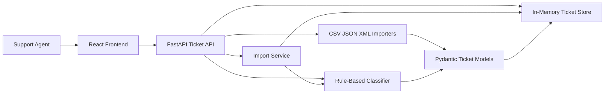

# Homework 2: Intelligent Customer Support System

> **Student Name**: Anastasiia Bocharnikova  
> **Date Submitted**: 2026-07-07  
> **AI Tools Used**: Codex

## Project Overview

This project is a customer support ticket management system. It provides a FastAPI backend for ticket CRUD, CSV/JSON/XML bulk import, rule-based auto-classification, filtering, and validation. It also includes a React frontend for support agents to create, edit, import, classify, and inspect tickets.

## Main Features

- Create, list, filter, update, and delete support tickets.
- Bulk import tickets from CSV, JSON, and XML files.
- Per-record import validation with partial success summaries.
- Auto-classify tickets into category and priority using keyword rules.
- Store classification confidence, reasoning, and matched keywords.
- React agent UI connected to the real API.
- Unit, API, parser, integration, negative, and performance tests.
- Valid and invalid sample data files.

## Tech Stack

- Backend: Python 3, FastAPI, Pydantic
- Frontend: React 18, Vite, lucide-react
- Testing: pytest, pytest-cov, FastAPI TestClient
- Storage: in-memory store for assignment scope

## Architecture



## Setup

From the repository root:

```bash
cd homework-2
python3 -m venv .venv
source .venv/bin/activate
pip install -r requirements.txt
cd frontend
npm install
```

## Run the Backend

```bash
cd homework-2
PYTHONPATH=src .venv/bin/uvicorn support_tickets.main:app --host 127.0.0.1 --port 3000
```

Shortcut:

```bash
cd homework-2
./demo/run-api.sh
```

Backend URL:

```text
http://127.0.0.1:3000
```

Interactive API docs:

```text
http://127.0.0.1:3000/docs
```

## Run the Frontend

In a separate terminal:

```bash
cd homework-2/frontend
npm run dev -- --host 127.0.0.1
```

Shortcut:

```bash
cd homework-2
./demo/run-frontend.sh
```

Frontend URL:

```text
http://127.0.0.1:5173
```

The frontend reads the API base URL from `VITE_API_BASE_URL`. If unset, it defaults to:

```text
http://127.0.0.1:3000
```

## Run Tests

```bash
cd homework-2
PYTHONPATH=src .venv/bin/pytest -q
```

## Check Coverage

```bash
cd homework-2
PYTHONPATH=src .venv/bin/pytest --cov=support_tickets --cov-report=term-missing
```

## Build Frontend

```bash
cd homework-2/frontend
npm run build
```

## Demo Requests

With the backend running, execute:

```bash
cd homework-2
./demo/sample-requests.sh
```

The script creates a ticket, auto-classifies it, lists urgent tickets, updates assignment/status, and imports the sample CSV file.

## Project Structure

```text
homework-2/
├── README.md
├── TASKS.md
├── requirements.txt
├── src/
│   └── support_tickets/
│       ├── classification.py
│       ├── importers.py
│       ├── main.py
│       ├── models.py
│       ├── services.py
│       └── store.py
├── tests/
│   ├── test_ticket_api.py
│   ├── test_ticket_model.py
│   ├── test_ticket_services.py
│   ├── test_ticket_store.py
│   ├── test_import_csv.py
│   ├── test_import_json.py
│   ├── test_import_xml.py
│   ├── test_categorization.py
│   ├── test_integration.py
│   ├── test_negative_verification.py
│   ├── test_performance.py
│   └── test_sample_data.py
├── frontend/
│   ├── index.html
│   ├── package.json
│   └── src/
├── demo/
│   ├── run-api.sh
│   ├── run-frontend.sh
│   └── sample-requests.sh
├── sample_data/
│   ├── valid/
│   └── invalid/
└── docs/
    ├── API_REFERENCE.md
    ├── ARCHITECTURE.md
    ├── TESTING_GUIDE.md
    ├── AI_USAGE.md
    └── screenshots/
```

## Sample Data

Valid sample data:

- `sample_data/valid/sample_tickets.csv` with 50 tickets
- `sample_data/valid/sample_tickets.json` with 20 tickets
- `sample_data/valid/sample_tickets.xml` with 30 tickets

Invalid sample data:

- `sample_data/invalid/invalid_tickets.csv`
- `sample_data/invalid/invalid_tickets.json`
- `sample_data/invalid/invalid_tickets.xml`

## Screenshots

Required final screenshots should be saved here:

- `docs/screenshots/test_coverage.png`
- `docs/screenshots/ui.png`

## Additional Documentation

- API consumers: `docs/API_REFERENCE.md`
- Technical architecture: `docs/ARCHITECTURE.md`
- QA/testing guide: `docs/TESTING_GUIDE.md`
- AI usage notes: `docs/AI_USAGE.md`

<div align="center">

*This project was completed as part of the AI-Assisted Development course.*

</div>
