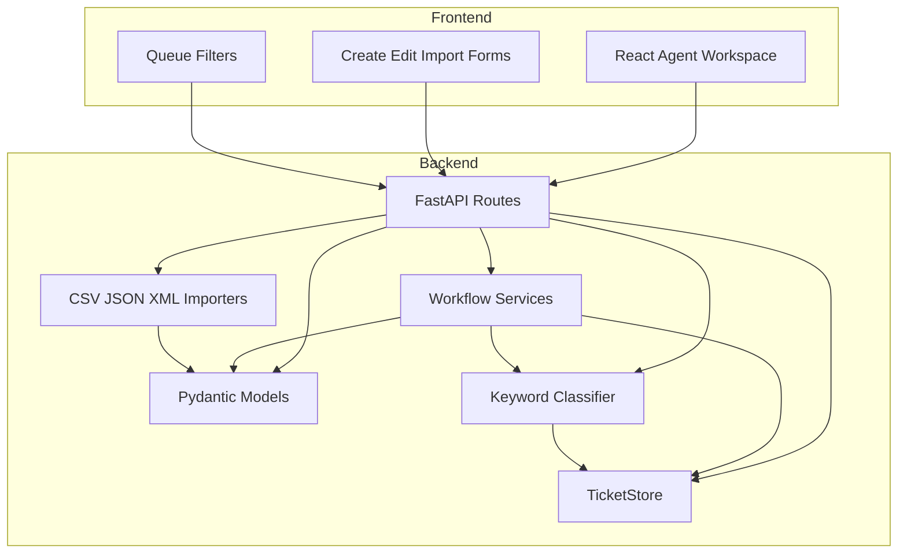
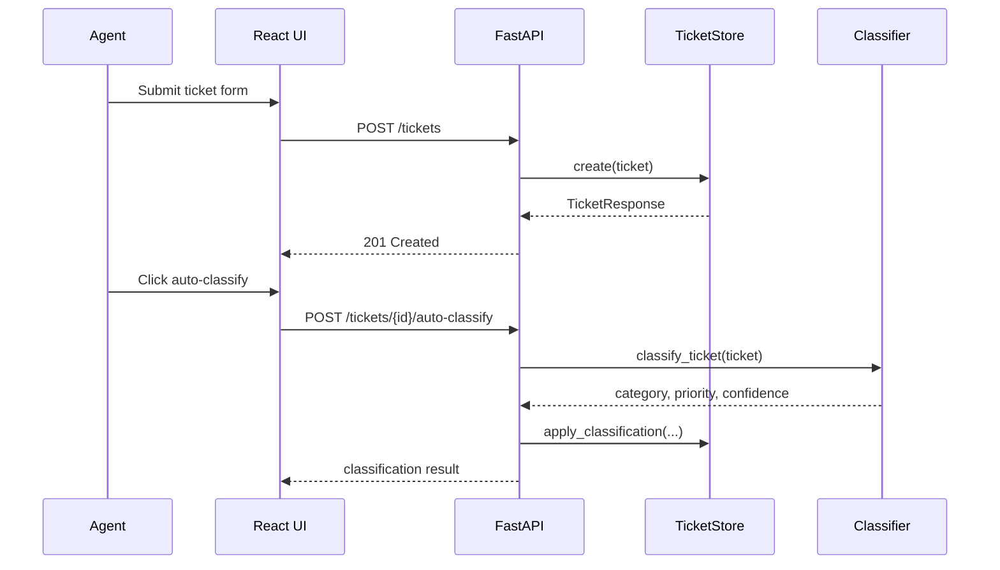
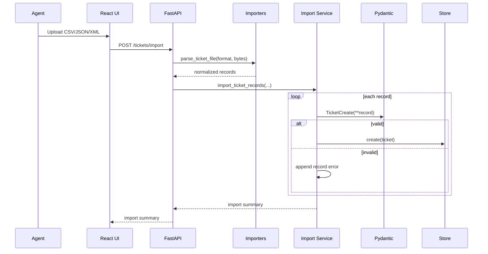

# Architecture

## Overview

The system uses a small layered architecture. FastAPI exposes the ticket API, service functions coordinate workflows, Pydantic validates request and response models, a thread-safe in-memory store holds tickets, importers normalize CSV/JSON/XML files, and a rule-based classifier assigns category and priority.

The React frontend is a single-page agent workspace that talks to the API through `fetch`.

## Component Diagram

## Backend Components

- `main.py`: FastAPI application, route handlers, CORS setup, and HTTP error mapping.
- `services.py`: workflow services for import validation, creation, and optional classification.
- `models.py`: ticket schemas, enums, import summary models, and response models.
- `store.py`: thread-safe in-memory CRUD store.
- `importers.py`: CSV, JSON, and XML parsing and normalization.
- `classification.py`: deterministic keyword classifier.

## Frontend Components

- `frontend/src/main.jsx`: React app, API calls, forms, filters, import flow, classification action.
- `frontend/src/styles.css`: responsive operational UI styling.
- `frontend/package.json`: Vite build and dev scripts.

## Ticket Lifecycle Flow

## Import Flow

## Design Decisions

- In-memory storage is used because the assignment does not require persistence.
- Classification is deterministic and rule-based, which keeps behavior testable and avoids external API keys.
- Import supports partial success so one bad record does not block valid tickets.
- React uses the real API only; the UI does not ship hardcoded ticket rows.
- Manual category or priority edits mark the ticket as a classification override.

## Security Considerations

- Pydantic validates all request payloads and enum values.
- XML parsing uses Python standard `xml.etree.ElementTree`; no external entity behavior is used.
- CORS is open for local assignment development. Production deployment should restrict allowed origins.
- File import accepts only parsed CSV, JSON, or XML formats and returns controlled parse errors.

## Performance Considerations

- The in-memory store is protected by `RLock` for concurrent test scenarios.
- Filtering is linear over stored tickets, acceptable for the assignment scope.
- Performance tests cover 100-ticket creation/import, 200-ticket filtering, 50-ticket classification, and 20 concurrent create requests.
