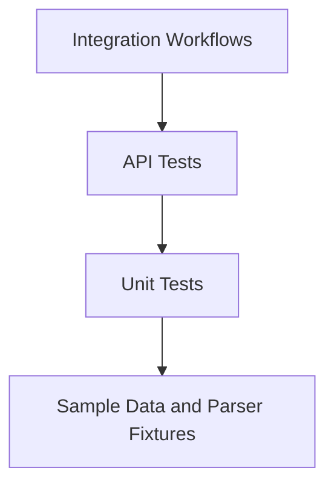

# Testing Guide

## Test Strategy

The test suite covers model validation, storage behavior, API endpoints, import parsers, classification rules, integration workflows, negative verification, sample data, and basic performance checks.



## Run All Tests

```bash
cd homework-2
PYTHONPATH=src .venv/bin/pytest -q
```

Current verified result:

```text
74 passed
```

## Run Coverage

```bash
cd homework-2
PYTHONPATH=src .venv/bin/pytest --cov=support_tickets --cov-report=term-missing
```

The assignment target is:

```text
Coverage: >85%
```

## Test Files

- `tests/test_ticket_model.py`: Pydantic ticket validation.
- `tests/test_ticket_store.py`: in-memory store behavior.
- `tests/test_ticket_services.py`: import workflow service behavior.
- `tests/test_ticket_api.py`: CRUD, import, and classification endpoints.
- `tests/test_import_csv.py`: CSV parser behavior.
- `tests/test_import_json.py`: JSON parser behavior.
- `tests/test_import_xml.py`: XML parser behavior.
- `tests/test_categorization.py`: category and priority rules.
- `tests/test_integration.py`: end-to-end workflows.
- `tests/test_negative_verification.py`: explicit invalid-input checks.
- `tests/test_performance.py`: lightweight benchmark/concurrency checks.
- `tests/test_sample_data.py`: sample file counts and validity.

## Sample Data

Valid files:

- `sample_data/valid/sample_tickets.csv`
- `sample_data/valid/sample_tickets.json`
- `sample_data/valid/sample_tickets.xml`

Invalid files:

- `sample_data/invalid/invalid_tickets.csv`
- `sample_data/invalid/invalid_tickets.json`
- `sample_data/invalid/invalid_tickets.xml`

## Performance Benchmarks

| Test | Expected Result |
| --- | --- |
| Create 100 tickets | Completes under 3 seconds |
| Import 100 JSON tickets | Completes under 2 seconds |
| 20 concurrent creates | All return `201` |
| Filter 200 tickets | Completes under 1 second |
| Classify 50 tickets | Completes under 2 seconds |

## Manual Testing Checklist

- Start backend at `http://127.0.0.1:3000`.
- Start frontend at `http://127.0.0.1:5173`.
- Create a ticket from the UI.
- Filter by category, priority, and status.
- Edit status and assigned agent.
- Trigger auto-classification and verify category/priority update.
- Import `sample_data/valid/sample_tickets.csv`.
- Import an invalid sample file and verify error feedback.
- Confirm mobile layout by narrowing the browser viewport.

## Screenshots

Save final submission screenshots here:

- `docs/screenshots/test_coverage.png`
- `docs/screenshots/ui.png`
