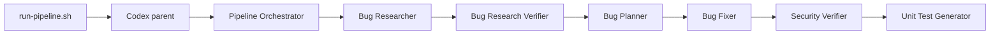

# Architecture

## Pipeline

The parent exists only to start the project-scoped orchestrator. The
orchestrator delegates each specialist stage sequentially, waits for the
required artifact, and stops when a prerequisite fails. All roles need
workspace write access to create their assigned reports, while role instructions
forbid source edits except during fixing and test generation.

## Application

`order.py` owns domain validation, decimal arithmetic, and safe receipt
rendering. `cli.py` owns argument parsing, conversion, user-facing errors, and
process status. This boundary keeps the core logic independently testable.

## Data Flow

Each stage reads the preceding Markdown artifact under
`context/bugs/001-order-receipt/`. The security and test roles both consume
`fix-summary.md` and referenced changed files. Skills provide the grading rules
for verified research and FIRST-compliant tests.
