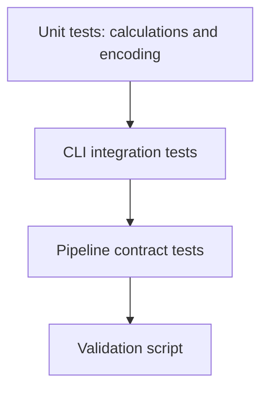

# Testing Guide

## Test Strategy



`tests/test_order.py` covers calculation, rounding, domain validation, blank
names, and hostile customer input. `tests/test_cli.py` exercises full valid and
invalid command workflows. `tests/test_pipeline_contract.py` checks agent
frontmatter, executable profiles, skills, stage order, report sections,
documentation, and screenshots.

## Commands

Full suite:

```bash
python3 -m unittest discover -s tests -v
```

Coverage:

```bash
python3 -m coverage run --source=src -m unittest discover -s tests
python3 -m coverage report --fail-under=86
```

Pipeline preflight:

```bash
./run-pipeline.sh --validate-only
```

Tests are deterministic and require no database, network, clock, random seed,
or external service.
