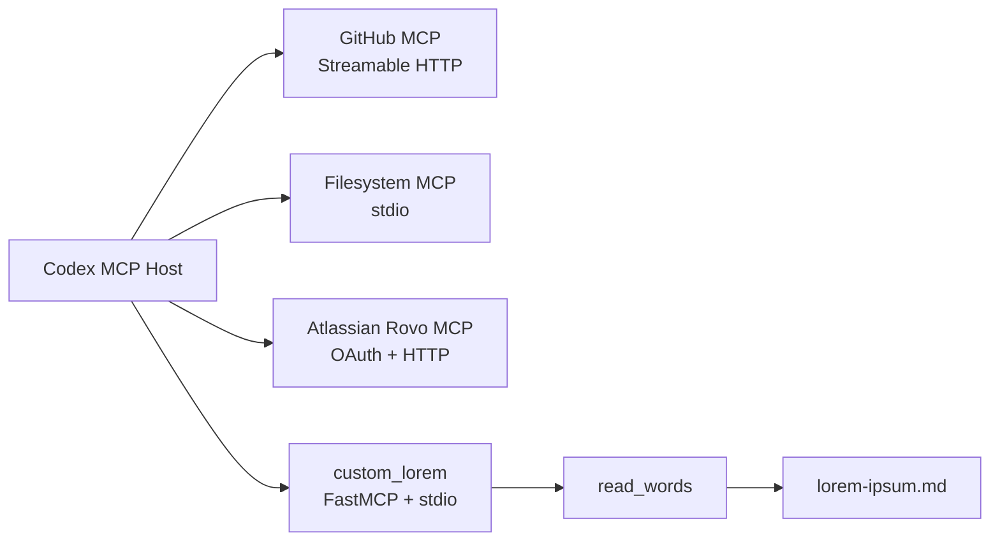
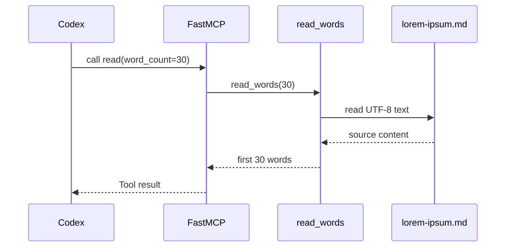

# Architecture

## Overview

Homework 5 connects three hosted/package MCP servers and one local custom server
to Codex. Each server is registered in project-scoped configuration, and the
custom server uses one shared function so its Resource and Tool cannot drift.

## Custom server components

- `SOURCE_FILE` resolves `lorem-ipsum.md` relative to `server.py`, independent
  of the process working directory.
- `read_words(word_count=30)` validates the count, reads UTF-8 text, splits it
  by whitespace, and returns the requested prefix.
- `lorem_resource(word_count=30)` exposes the reader through
  `lorem://content{?word_count}`.
- `read(word_count=30)` exposes the same reader as an MCP Tool.
- `mcp.run()` starts the default stdio transport when the script is executed.

## Request flow

## Security boundaries

- GitHub credentials come from `GITHUB_PAT_TOKEN`, not committed configuration.
- Jira OAuth credentials are stored by Codex outside the repository.
- Filesystem tools are restricted to read operations and the Homework 5 folder.
- The custom Tool is explicitly annotated as read-only and exposes no arbitrary
  path or command parameter.
