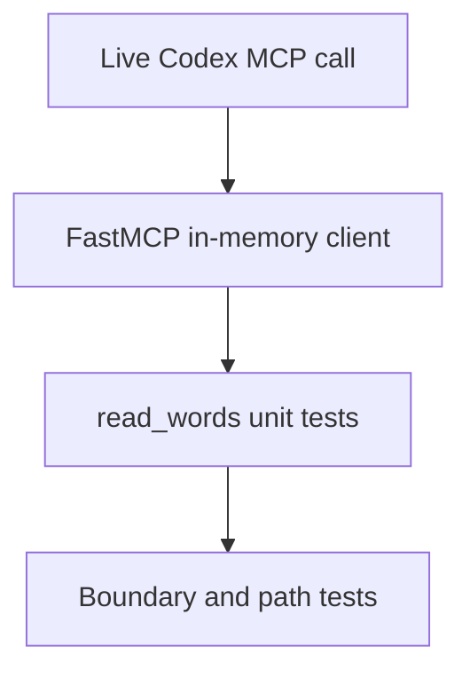

# Testing Guide

## Setup

From `homework-5/`:

```bash
python3.11 -m venv .venv
.venv/bin/python -m pip install -r custom-mcp-server/requirements.txt
```

## Test strategy



The suite uses real FastMCP registrations rather than mocked MCP calls.

## Run tests

```bash
.venv/bin/python -m pytest tests/test_custom_mcp_server.py -v
```

Covered behaviors:

- default helper output contains exactly 30 words;
- custom word count returns the matching source prefix;
- zero and negative counts are rejected;
- counts larger than the source are rejected;
- source resolution is independent of the current working directory;
- Resource default returns 30 words;
- parameterized Resource and Tool return identical content;
- Tool metadata declares the operation read-only and non-destructive.

## Coverage

```bash
.venv/bin/python -m pytest \
  --cov=custom-mcp-server \
  --cov-report=term-missing \
  --cov-fail-under=85
```

Current verified result: 8 tests pass with 95% statement coverage.

## Configuration checks

```bash
python3 -m json.tool mcp.json
codex mcp list
codex mcp get custom_lorem
git diff --check
```

## Live MCP verification

```text
Using only the custom_lorem MCP server, call the read tool with word_count set
to 30. Return the tool result and state the exact number of returned words. Do
not modify any files.
```

The expected trace contains `custom_lorem/read (completed)` and reports an exact
word count of `30`.
